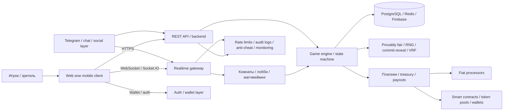

# Аналитический отчёт по GitHub-репозиториям игр в кости с мультиплеером и ставками

## Executive summary

По состоянию на 28 апреля 2026 года точных публичных GitHub-совпадений по сочетанию **dice game + online multiplayer + betting/money + свежая активность + пригодная OSS-лицензия** оказалось немного. В моей выборке самым близким рабочим совпадением выглядит **drdreo/Owe-Drahn**: это действительно multiplayer dice gambling game с отдельными client/server частями и свежими коммитами. Концептуально очень силён **unju-ai/hyperliquid-liars-dice**, но сейчас это скорее **doc-first/roadmap-репозиторий**, чем готовая кодовая база. Для изучения платёжных рельс, fairness и productization гораздо полезнее платформенные репозитории вроде **tankcdr/clawsino**, **AP3X-Dev/Solana-Casino** и **LaChance-Lab/solana-casino-games-evm-web3**, хотя у них dice-механика обычно не является именно PvP-игрой в кости. citeturn5view0turn10view0turn8view2turn16view0turn31view0turn32view0turn11view2

Если смотреть не на «идеальное совпадение», а на **что реально стоит форкать или разбирать по частям**, картина такая. Для real-time room/state-архитектуры подойдут **Owe-Drahn** и **thehijacker/dicesoccer**; для криптоставок, provably fair и payout-логики — **Clawsino**, **AP3X-Dev/Solana-Casino** и **LaChance-Lab**; для legal/payment/compliance-слоя с фиатом и криптой — **utkarshsingx/picks.**; для экспериментального геймдизайна «деньги на столе» — **hyperliquid-liars-dice**; для близкого, но не чистого dice-match, — **jelilat/onchain-ludo**. citeturn5view0turn19view3turn29view1turn32view0turn7view4turn19view1turn8view2turn8view3

Отдельный важный вывод: у заметной части проектов **лицензия либо MIT, либо вообще не указана**. Для коммерческого форка это не мелочь, а один из ключевых фильтров: код без явного `LICENSE` технически можно читать, но юридически использовать и особенно перепродавать значительно рискованнее, чем репозитории с явно указанной MIT-лицензией. citeturn30view6turn33view0turn7view4turn6view0turn5view0turn5view2turn19view1turn19view3

## Методика и рамки отбора

Я искал только **публичные GitHub-репозитории**, затем вручную проверял их через README, дерево файлов, страницы commit history и, где было полезно, страницы workflow/security. Приоритетом были: наличие multiplayer-слоя через WebSocket/Socket.IO/реалтайм-каналы, наличие ставок/валюты/транзакций, активность по коммитам за последние два года, лицензия, Docker/инструкции по развёртыванию, тесты/CI и любые указания на безопасность или anti-cheat. citeturn5view0turn29view1turn32view0turn5view3turn19view1turn8view2turn8view3turn19view3

Поскольку точных совпадений немного, я сознательно включил три типа артефактов и пометил степень соответствия:  
**точные/почти точные** — multiplayer dice + gambling;  
**платформенные совпадения** — casino/game platform с dice и деньгами, но без PvP-dice;  
**архитектурные референсы** — multiplayer dice без денег, если у них современная сетевая/ops-реализация. Такой подход лучше отражает реальное состояние open-source ниши, чем попытка искусственно собрать только «идеальные» совпадения. citeturn5view0turn29view1turn32view0turn19view1turn8view2turn8view3turn19view3

## Сравнительная таблица

| Репозиторий | Стек | Мультиплеер | Ставки / деньги | Лицензия | Последний коммит | Docker / CI | Готовность | Соответствие |
|---|---|---|---|---|---|---|---|---|
| **drdreo/Owe-Drahn** citeturn5view0turn10view0turn15view0turn35view0turn36view0 | React, Node.js, TypeScript, Nest, Firebase | Есть, через websocket/socket-модули и server-side game logic | Внутриигровая gambling-механика; явных fiat/crypto payment rails не видно | Не указана явно | 2025-11-04 | Docker не виден; CI не виден | demo / hobby, но рабочий | **Почти точное** |
| **tankcdr/clawsino** citeturn29view1turn30view4turn30view6turn30view8turn31view0 | TypeScript/Express, Solidity/Foundry, Python, Docker Compose | Не PvP; есть live WebSocket dashboard | USDC microtransactions через x402, `/api/dice`, payout contracts | MIT | 2026-02-20 | Docker есть; test/integration scripts есть | serious prototype / deployable demo | **Платформенное** |
| **LaChance-Lab/solana-casino-games-evm-web3** citeturn7view4turn8view0turn8view1turn6view8turn11view2turn14view0 | Rust/Anchor, Solidity, Foundry, Hardhat, Telegram bot scaffold | Dice не PvP, но есть multiplayer poker/tournaments/challenges | SPL/ERC-20, VRF, on-chain payouts, pools/limits | MIT | 2026-04-21 | Tests, docs, workflows | prod-oriented / broad platform | **Платформенное** |
| **AP3X-Dev/Solana-Casino** citeturn32view0turn33view0turn33view4turn33view5turn34view0turn37view0 | TypeScript, Rust, Vite, Docker, Jest | Прямого PvP-dice нет; есть in-chat/community mechanics | SPL-token betting, wallet integration, payouts | MIT | 2025-12-14 | Docker/Docker Compose и `ci-cd.yml` есть | active product prototype | **Платформенное** |
| **utkarshsingx/picks.** citeturn19view1turn17view5turn18view8turn18view9turn22view3turn25search6 | Next.js, Django, DRF, PostgreSQL, Django Channels | WebSocket явно есть для Crash; dice itself instant, не PvP | BTC/ETH/USDT/USD, fiat+crypto deposits, Stripe/NowPayments | Не указана явно | 2026-03-17 | Docker не виден; отдельный `daphne`/scheduler flow | active beta / prototype | **Платформенное** |
| **unju-ai/hyperliquid-liars-dice** citeturn8view2turn16view0turn6view0turn11view0 | Планируются Bun, Next.js, WebSocket, Solidity, Prisma | Задуман real-time multiplayer | Каждая ставка = реальная perpetual position на Hyperliquid | MIT | 2026-02-25 | Локальный старт есть, но реальных модулей пока нет | concept / doc-only | **Очень близкое концептуально** |
| **jelilat/onchain-ludo** citeturn8view3turn6view4turn11view1 | TypeScript, Next.js, Prisma, WebSockets | Есть, комнаты и real-time gameplay | Spectator staking / prediction market | Не указана явно | 2024-10-29 | Docker/CI не видны | prototype | **Близкое, но не pure dice** |
| **thehijacker/dicesoccer** citeturn19view3turn20view3turn20view4turn27view2turn27view5turn22view1 | HTML/CSS/JS, Node.js, Socket.IO, Docker, PWA | Есть, lobby matchmaking + spectator mode | Денежной механики нет | Не указана явно | 2025-11-07 | Docker и GitHub Actions есть | working demo / self-host | **Архитектурный референс** |

## Подробный разбор репозиториев

**drdreo/Owe-Drahn**  
Описание: README прямо называет проект *pure luck based gambling game* и *simple multi-player dice gambling game*; правило игры простое — проигрывает тот, кто выбрасывает больше 15, а 3 считается за 0. Это один из немногих найденных репозиториев, где одновременно есть явная dice-механика, multiplayer и слово *gambling* не только в описании, но и в структуре проекта.  
Стек: корень раздён на `client/` и `server/`; README говорит о React и Node.js, а серверная часть в `server/` выглядит как Nest/TypeScript-проект. Для хранения состояния/данных требуется отдельный проект на entity["company","Firebase","google cloud db"].  
Мультиплеер и ставки: в `server/src/game` присутствуют `socket/`, `Game.ts`, `game.controller.ts`, `game.service.ts`; это хороший индикатор server-authoritative room/game-state логики. При этом явных интеграций с фиатом, криптокошельками или платёжными провайдерами в видимом README и корневом дереве не видно, поэтому ставки здесь я бы трактовал как **внутриигровую gambling-механику**, а не как production-ready money betting.  
Лицензия и дата: явной OSS-лицензии на главной странице не видно; последний коммит — **4 ноября 2025 года**.  
Готовность: по моему впечатлению, это **рабочий demo/hobby-проект**, а не полная casino-platform codebase, но как база под real-time dice room он очень полезен.  
Развёртывание / Docker / CI: запуск описан явно — `npm i`, затем отдельно `cd server && npm run dev` и `cd client && npm start`; нужен Firebase config. В `server/` есть `test/` и spec-файлы, но Docker и CI в видимом корне не просматриваются, а `.github` содержит только `FUNDING.yml`.  
Риски: для коммерческого использования главный минус — **отсутствие явной лицензии**. По свежим коммитам видно, что автор занимался anti-spam и Sentry-интеграцией, что хорошо для живого прототипа, но полноценная модель anti-cheat и money-compliance в README не задокументирована. citeturn5view0turn7view6turn10view0turn12view0turn15view0turn35view0turn36view0

**tankcdr/clawsino**  
Описание: это не PvP-игра «два игрока кидают кости друг против друга», а **agent-native crypto casino**, где есть игра Dice (2d6), провайдер платежей на основе x402 и on-chain proof/fairness-паттерны. Для исследователя это один из самых ценных репозиториев в подборке, если вас интересуют не столько комнаты/лобби, сколько **денежный контур, payout-логика и provably fair proof path**.  
Стек: README и дерево показывают `server/` на TypeScript/Express, `contracts/` на Solidity/Foundry, `skill/` на Python и `dashboard/` с live WebSocket-наблюдением.  
Мультиплеер и ставки: ставки реализованы намного лучше, чем multiplayer: есть x402 payment negotiation, USDC, payout contracts, эндпоинт `POST /api/dice`, история, лидерборд и fairness verification через commit-reveal. Multiplayer в человеческом PvP-смысле я здесь не вижу; realtime-компонент — это прежде всего **live dashboard через WebSocket**, то есть скорее spectator/ops plane, чем game room plane.  
Лицензия и дата: лицензия **MIT**, последний коммит — **20 февраля 2026 года**.  
Готовность: я бы оценил как **serious prototype / deployable demo**. Тут уже есть интеграционные тестовые сценарии, health checks и достаточно внятный deployment story.  
Развёртывание / Docker / CI: сильная сторона репозитория — качественный quick start через `docker compose up -d`; Compose поднимает local Base fork, init/deploy и game API.  
Риски: это деньги и крипта буквально «из коробки», значит юридическая и compliance-нагрузка здесь максимальная. Дополнительно README сам говорит, что для production отличий нужен настоящий on-chain режим и рассматривается будущий апгрейд на Chainlink VRF, то есть текущий fairness-путь ещё не выглядит финальной архитектурой для regulated production. citeturn29view1turn30view0turn30view2turn30view4turn30view6turn30view7turn30view8turn31view0

**LaChance-Lab/solana-casino-games-evm-web3**  
Описание: автор позиционирует репозиторий как **production-ready multi-chain casino platform** на Solana и EVM, включая 10 игр, из которых Dice — лишь одна. Для вашего запроса это не столько «готовая мультиплеерная игра в кости», сколько **широкая инженерная база** для fairness, chain abstraction, treasury/risk-management, token pools и Telegram-facing surface.  
Стек: по README видны Rust + Anchor для Solana, Solidity + Foundry/Hardhat для EVM, документация в `docs/`, `telegram-bot/`, тесты на Solana/EVM и workflow-файлы в `.github/workflows`.  
Мультиплеер и ставки: Dice реализован как under/over + VRF с probability-based payout, а не как room-based PvP. Но на уровне платформы есть multiplayer-tournament элементы: poker tournaments, Telegram group tournaments/challenges, real-time leaderboards и instant payouts. Ставки завязаны на SPL/ERC-20 совместимость, liquidity pools, динамические лимиты и on-chain fairness.  
Лицензия и дата: лицензия **MIT**, последний коммит — **21 апреля 2026 года**.  
Готовность: по набору каталогов, quick start и тестов это выглядит как **prod-oriented platform repo**, хотя часть заявлений в README очень амбициозна и требует отдельной ручной верификации по коду.  
Развёртывание / Docker / CI: quick start покрывает `anchor test`, `forge test -vvv`, deployment на Solana Devnet и Ethereum Sepolia; в workflows есть `deploy.yml` и `seo-check.yml`.  
Риски: README заявляет anti-cheat, multisig, timelock, IP tracking, fraud detection и даже professional audits — всё это звучит сильно, но всё же это именно **self-description** репозитория. Для вашей задачи важнее другое: dice здесь не является полноценным synchronous PvP-game, поэтому использовать его стоит скорее как базу для betting/fairness/treasury, а не как финальный multiplayer dice loop. citeturn6view8turn6view9turn7view4turn8view0turn8view1turn11view2turn14view0

**AP3X-Dev/Solana-Casino**  
Описание: репозиторий строит Solana-based casino platform и отдельно документирует Dice Roll с roll under/over, динамическими множителями и историей. Практическая ценность здесь в том, что проект уже совмещает **wallet UX, on-chain betting, frontend, Docker, Jest и CI/CD**, то есть даёт хорошую «скелетную» базу продукта.  
Стек: TypeScript доминирует во frontend/backend-части, есть Rust-код в `programs/casino`, Dockerfile, `docker-compose.yml`, `jest.config.cjs` и workflow `ci-cd.yml`.  
Мультиплеер и ставки: прямого PvP-dice здесь не видно. Зато есть community/in-chat слой через entity["company","Telegram","messaging platform"], wallet integration с Phantom, custom liquidity pools и automated payouts; для dice это означает скорее **house-banked betting mechanic**, чем game room между двумя людьми.  
Лицензия и дата: **MIT**, последний коммит — **14 декабря 2025 года**.  
Готовность: я бы поставил **active product prototype**: проект выглядит свежим, цельным и удобным для форка, если ваша траектория — «web3 casino first, pure PvP dice second».  
Развёртывание / Docker / CI: presence `Dockerfile`, `docker-compose.yml` и отдельного workflow — хороший плюс.  
Риски: fairness в README иллюстрируется SHA256-комбинацией client/server seed, а не явно внешним VRF-провайдером; значит для production-grade gambling вам, вероятно, понадобится усилить randomness/auditability. Кроме того, multiplayer dice тут не центральный use-case. citeturn32view0turn33view0turn33view4turn33view5turn34view0turn37view0

**utkarshsingx/picks.**  
Описание: это широкая betting platform, а не чистый dice-game repo. Но для исследователя она очень полезна, потому что сочетает **casino games, sportsbook, wallets, fiat+crypto deposits, webhook flow, 2FA и WebSocket real-time** в одной codebase.  
Стек: README указывает Next.js + TypeScript на фронте и Django/DRF/PostgreSQL на бэке; для real-time используется Django Channels, а запуск realtime round scheduler описан через `daphne` и отдельную management-команду.  
Мультиплеер и ставки: dice здесь есть как over/under instant-resolution game, но именно multiplayer/real-time по README раскрыт прежде всего для Crash через WebSocket endpoint. Денежная часть заметно сильнее game-room слоя: multi-currency wallets, atomic balance operations, crypto deposits via entity["company","NowPayments","crypto payments"], fiat via entity["company","Stripe","payments company"], withdrawals, webhook handlers, bet history.  
Лицензия и дата: явной лицензии на главной странице не видно; последний коммит — **17 марта 2026 года**.  
Готовность: **active beta / prototype**. Это один из наиболее свежих и «бизнесово-полных» репозиториев в списке, но не лучший выбор, если вам нужна именно PvP-dice multiplayer game loop.  
Развёртывание / Docker / CI: развёртывание описано вручную через backend/frontend envs, `daphne` и scheduler; Docker в видимых файлах не заявлен.  
Риски: интеграция реальных денег и крипты резко повышает юридический риск. Отдельно отмечу, что GitHub Security page показывает **No security policy detected**, так что repo активный, но governance/security-processes формализованы слабо. citeturn19view1turn17view5turn18view8turn18view9turn22view3turn25search6

**unju-ai/hyperliquid-liars-dice**  
Описание: концепция очень сильная: это on-chain Liar’s Dice, где **каждая ставка/bid открывает реальную perpetual position** на entity["company","Hyperliquid","crypto exchange"], а исход раунда завязан и на блеф, и на P&L. Для исследования механик «игра + деньги + рынок» это одна из самых интересных находок.  
Стек: README обещает Bun, Next.js, React Three Fiber, Solidity, Prisma и backend с `ws/` для realtime multiplayer.  
Мультиплеер и ставки: именно по идее запросу пользователя репозиторий соответствует почти идеально — multiplayer dice, money on the line, real-time server и контрактный слой.  
Лицензия и дата: **MIT**, последний коммит — **25 февраля 2026 года**.  
Готовность: проблема в том, что текущая реальность репозитория существенно слабее концепции. README рисует структуру `contracts/`, `frontend/`, `backend/`, но фактическое дерево на странице репозитория сейчас показывает только `docs/`, `README.md` и `ROADMAP.md`; поэтому я оцениваю его как **concept / doc-only**, а не как кодовую основу для немедленного форка.  
Развёртывание / Docker / CI: локальный старт через `bun install` и `bun dev` описан, но полноценной кодовой поверхности пока нет.  
Риски: здесь одновременно смешаны gambling, derivatives trading и потенциальные liquidation-events, так что legal/compliance-риск максимальный даже по меркам web3-gaming. Если вы его форкаете, то скорее как исследовательский дизайн-док, чем как production starter. citeturn8view2turn16view0turn6view0turn11view0

**jelilat/onchain-ludo**  
Описание: это уже не «чистая игра в кости», а Ludo — то есть dice-driven board game. Тем не менее repo важен, потому что в нём сочетаются **комнаты, WebSockets и staking/prediction market**, а это очень близко к вашему поисковому вектору.  
Стек: по дереву видно TypeScript/Next.js/Prisma, а README прямо говорит о multiplayer room flow и WebSockets.  
Мультиплеер и ставки: игроки создают/джойнят комнаты, а зрители могут stake tokens на победителя; odds меняются по мере ставок. Это не roulette-style house betting и не dice duel, но как референс для «multiplayer game + wagering overlay» репозиторий полезен.  
Лицензия и дата: явная лицензия не видна; последний коммит — **29 октября 2024 года**.  
Готовность: я бы назвал это **prototype**.  
Развёртывание / Docker / CI: старт минимальный, через `npm run dev`; README дополнительно ссылается на отдельные zk prover/verifier и websocket server, поэтому вся система не полностью self-contained в одном root.  
Риски: для коммерческого форка тут сразу два красных флага — отсутствие явной лицензии и неполная самодостаточность. Плюс это всё-таки **не pure dice game**, а близкий по паттернам проект. citeturn8view3turn6view4turn11view1

**thehijacker/dicesoccer**  
Описание: это современная активная multiplayer dice game без betting-слоя. В контексте вашего исследования она ценна не деньги-механикой, а тем, что показывает **как выглядит нормально упакованный WebSocket multiplayer repo в 2025 году**: лобби, spectator mode, Docker, workflow и self-hosting.  
Стек: HTML/CSS/Vanilla JS на клиенте, Node.js WebSocket server с Socket.IO на realtime-слое, плюс PWA-функции.  
Мультиплеер и ставки: multiplayer реализован через lobby-based matchmaking, challenge/accept flow, spectator updates и отдельный `websocket-server`. Денег/валюты/платежей нет, поэтому это не совпадение по betting, а именно **архитектурный референс** для сетевого движка и UX лобби.  
Лицензия и дата: явная лицензия не видна; последний коммит — **7 ноября 2025 года**.  
Готовность: **working demo / self-host**.  
Развёртывание / Docker / CI: README даёт два варианта Docker-развёртывания — frontend-only и full stack с websocket-server, а production-конфиг для GitHub Pages генерируется GitHub Actions workflow.  
Риски: денежной механики нет, поэтому repo не решает core betting-задачу. Но если вам нужен современный шаблон realtime-коммуникации, матчмейкинга и spectator-mode, он практичнее многих «crypto casino» репозиториев, которые выглядят богато на README, но слабее на сетевой архитектуре. citeturn19view3turn20view3turn20view4turn27view2turn27view5turn22view1

## Архитектурные выводы и юридические риски

Главный технический паттерн по выборке такой: **игровой цикл, realtime-слой и money-layer почти всегда живут отдельно**. Multiplayer чаще всего строится через WebSocket/Socket.IO/Channels/комнатную модель, а ставки — либо как on-chain treasury/contracts/payouts, либо как wallet/balance/webhook/payment subsystem. Именно поэтому наиболее практичная стратегия форка выглядит не как «найти один идеальный репозиторий», а как комбинирование: взять room/game-state из Owe-Drahn или DiceSoccer, а платёжный/fairness-контур — из Clawsino, AP3X, LaChance или picks. citeturn36view0turn27view5turn30view7turn33view5turn8view1turn18view8

По лицензиям картина смешанная. Самые безопасные для форка в коммерческом или полупродакшн-сценарии из этой подборки — **Clawsino**, **AP3X-Dev/Solana-Casino**, **LaChance-Lab/solana-casino-games-evm-web3** и **hyperliquid-liars-dice**, поскольку у них явно указана MIT. У **Owe-Drahn**, **onchain-ludo**, **picks.** и **dicesoccer** явный `LICENSE` на главной странице/в дереве не просматривается, а значит перед любым использованием я бы трактовал их как **read-only study material**, пока авторы не добавят лицензию. citeturn30view6turn33view0turn7view4turn6view0turn5view0turn5view2turn19view1turn19view3

По безопасности лучшие практики распределены неравномерно. **LaChance-Lab** декларирует rate limiting, IP tracking, suspicious activity alerts и treasury protection; **picks.** показывает 2FA, multi-currency wallets и webhook secret handling; **Clawsino** хорошо оформляет payment/fairness/contract boundaries и deployable local chain flow; а в **Owe-Drahn** в свежих коммитах видны хотя бы Sentry и anti-spam работы. Но одновременно у части репозиториев не видно формальной security policy, а у doc-heavy проектов заметна дистанция между README-обещаниями и фактическим кодом. citeturn8view1turn17view5turn25search6turn30view7turn10view0turn16view0

С точки зрения легальности и продуктового риска вывод жёсткий: как только в проекте появляются реальные деньги, криптовалютные депозиты/выводы, payout contracts, fiat processors, social betting или perpetual positions, вам почти неизбежно понадобится отдельный слой по **лицензированию, KYC/AML, возрастным ограничениям, геоблокингу, ответственному гемблингу и dispute handling**. Это не конкретный юридический совет по юрисдикции, а инженерный вывод из самих репозиториев: **picks.** уже включает fiat/crypto rails, **Clawsino** — USDC/x402 payouts, **AP3X** и **LaChance** — tokenized betting и responsible gaming controls, а **hyperliquid-liars-dice** добавляет поверх этого ещё и деривативную торговлю. citeturn18view8turn18view9turn30view8turn33view5turn33view1turn8view1turn8view2

Если свести всё к практическому shortlist для изучения и форка, мой порядок был бы таким. **Для immediate multiplayer dice prototype** — сначала Owe-Drahn, затем DiceSoccer как reference по lobby/spectator/deployment. **Для betting/payout/fairness** — сначала Clawsino, затем AP3X и LaChance. **Для исследовательских концептов на стыке игры и финансов** — hyperliquid-liars-dice и onchain-ludo. **Для payment/compliance-процесса с fiat/crypto** — picks. citeturn5view0turn19view3turn29view1turn32view0turn7view4turn8view2turn8view3turn19view1

## Mermaid-диаграмма типового проекта

Ниже — обобщённая архитектура, которая чаще всего повторялась в найденных репозиториях: frontend/клиент отдельно, realtime gateway отдельно, game engine/state отдельно, а деньги и fairness вынесены в свой слой — через платёжные API, кошельки или смарт-контракты. Это именно **сводный шаблон**, а не схема какого-то одного репозитория. citeturn36view0turn27view5turn30view7turn8view1turn18view8turn18view9

